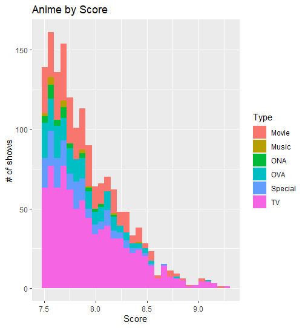

---
---
---

**to make a plot we use the ggplot() function**

### header 3

plotting

scatterplot

1.[GITHUB](~/1_%20Intro_R/data/dataanime.csv)



```{r plot, echo = F}
#comment
library(ggplot2)

ggplot(data=mpg,aes(x=hwy))+geom_density()
```

```{python}
for x in range(5):
  print("fox is cute :D")
```

add text between chunks

```{r}

```

| Col1 | Col2 | Col3 |
|------|------|------|
|      |      |      |
|      |      |      |
|      |      |      |

$1+1$

open source software is computer software that is released under a liscense in which the copyright holder grants users the rights to use, study, change, and distribute the software and its source code to anyone and for any purpose github provides a platform for developers to work together

a tracked file means that git is aware of them untracked is untracked tracked are like actors in costumes, untracked is like actors in the back who aren't ready yet

repository is where code is stored, what you are currently working on and all the past versions

the most recent version of your project that you have uploaded to the remote repository

from working directory git add to staging area, git commit to repository and then git push to remote repository
